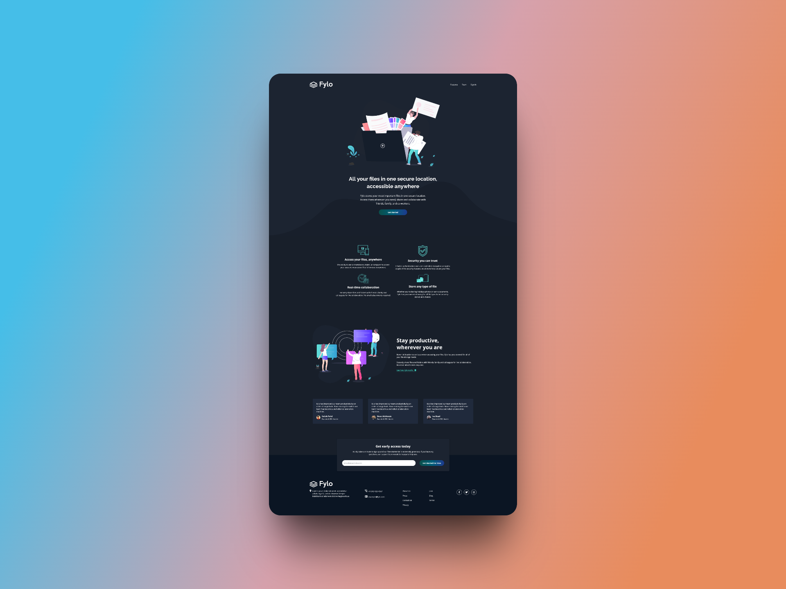
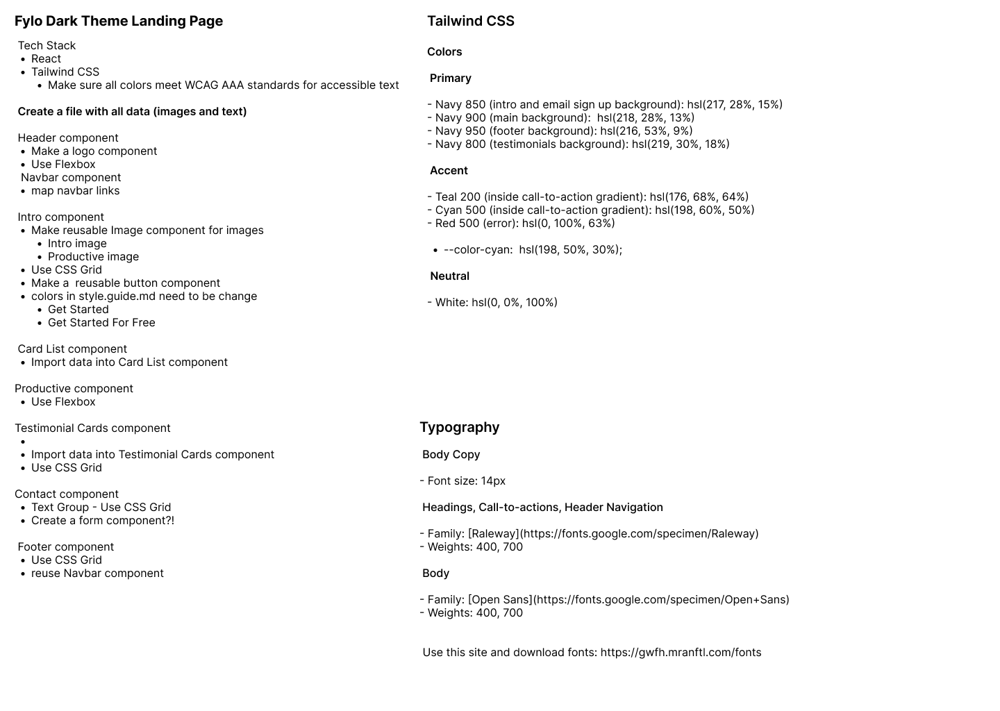

# Frontend Mentor - Fylo dark theme landing page solution

This is a solution to the [Fylo dark theme landing page challenge on Frontend Mentor](https://www.frontendmentor.io/challenges/fylo-dark-theme-landing-page-5ca5f2d21e82137ec91a50fd). Frontend Mentor challenges help you improve your coding skills by building realistic projects. 

## Table of contents

- [Overview](#overview)
  - [The challenge](#the-challenge)
  - [Screenshot](#screenshot)
  - [Links](#links)
- [My process](#my-process)
  - [Built with](#built-with)
  - [What I learned](#what-i-learned)
  - [Continued development](#continued-development)
  - [Useful resources](#useful-resources)
- [Author](#author)

## Overview

### The challenge

Users should be able to:

- View the optimal layout for the site depending on their device's screen size
- See hover states for all interactive elements on the page

### Screenshot

### Links

- Solution URL: [Frontend Mentor]()
- Live Site URL: [GitHub Pages](https://bccpadge.github.io/fylo-dark-theme)

## My process

### Built with

  
  
  

### What I learned
In this project, I learned how to use:
* React basics:
	+ making a custom button component with props
	+ making a custom card component with props
* Tailwind CSS to create a responsive and visually appealing landing page.

### Continued development
- I will plan in Figma before coding.

### Useful resources

- [Shots](https://shots.so/) - Create and share beautiful screenshots of your site
- [google-webfonts-helper](https://gwfh.mranftl.com/fonts) - Free way to use Google Fonts on your website
- Deploying a React Vite App to GitHub Pages - [Video](https://www.youtube.com/watch?v=hn1IkJk24ow)

## Author

- [Rebecca Padgett](https://linkedin.com/in/rebeccapadgett121) on LinkedIn

## Acknowledgments
- [Fylo Dark Theme Landing Page](https://fylo-dark-theme-landing-page-hdez.vercel.app/) - This solution was created by [Melvin Aguilar](https://github.com/MelvinAguilar) on GitHub and was used as a reference for this project.

